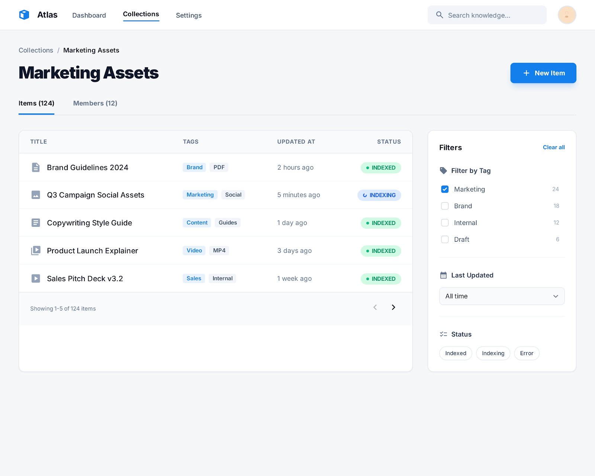
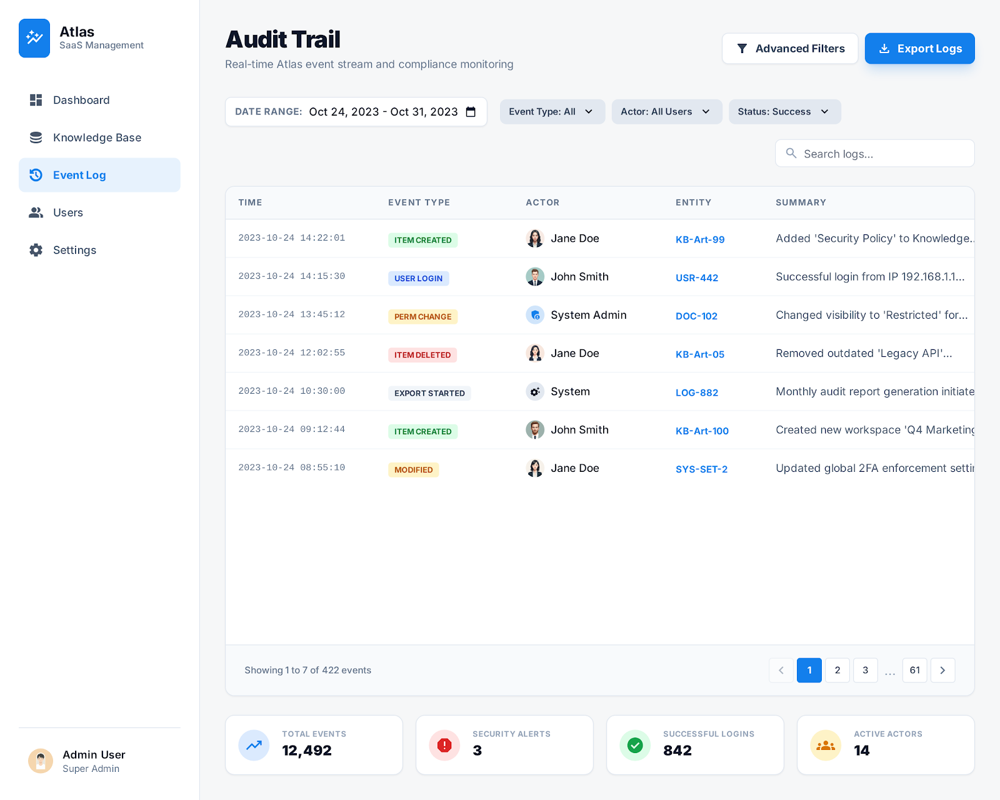

# Atlas — Event-Driven Knowledge Platform (Python/FastAPI + Postgres + Kafka + Elasticsearch)

## Motivation (why this project exists)
Atlas is a portfolio project built to demonstrate “real-world backend engineering” beyond simple CRUD:
- Clean API design (validation, pagination, consistent errors)
- Security fundamentals (JWT auth + RBAC)
- Event-driven architecture (Kafka domain events)
- Search at scale (Elasticsearch read-model + eventual consistency)
- Reliability patterns (idempotency, retries, background jobs)
- Strong engineering discipline (TDD, tests, documentation)
- Cloud-native path (Docker Compose → local Kubernetes → GCP GKE Autopilot + Cloud SQL)

The goal is to have a project that looks and feels like a production system: multiple components, clear boundaries, and a staged path to cloud deployment.

---

## UI Mockups

<table>
  <tr>
    <td></td>
    <td></td>
  </tr>
  <tr>
    <td></td>
    <td></td>
  </tr>
  <tr>
    <td></td>
    <td></td>
  </tr>
  <tr>
    <td></td>
    <td></td>
  </tr>
</table>

---

## What the product does (user view)
Atlas lets users:
- Create “Collections” (like folders/workspaces)
- Add “Items” (notes/resources/links) inside collections
- Tag items and later search across items efficiently
- Share collections with other users using role-based access control
- Trigger background processing (e.g., enrich a link with metadata)
- View an audit trail of changes (who changed what and when)

---

## Components (what we build)
### 1) API Service (FastAPI)
- Handles REST endpoints
- Implements JWT authentication
- Enforces RBAC (owner/editor/viewer) for each collection
- Writes all authoritative data to Postgres
- Publishes domain events to Kafka after writes (ItemCreated, ItemUpdated, etc.)
- Exposes OpenAPI docs (/docs)

### 2) Postgres (Source of Truth)
- Stores users, collections, memberships, items, tags, job status, and audit events
- Single authoritative database; other systems (Elasticsearch) are derived read models

### 3) Kafka (Event Bus)
- Transports domain events emitted by API
- Enables decoupled consumers:
  - Audit consumer (writes audit trail)
  - Indexer consumer (updates Elasticsearch)
  - Worker (optional triggers)

### 4) Audit Consumer (Kafka → Postgres)
- Consumes all domain events
- Stores immutable audit records in Postgres
- Supports audit queries (by user, entity, time window)

### 5) Indexer Consumer (Kafka → Elasticsearch)
- Consumes item-related events
- Fetches current item state from Postgres
- Upserts documents into Elasticsearch index
- Powers the search endpoint

### 6) Elasticsearch (Search Read-Model)
- Stores indexed documents for Items only
- Used for full-text search + filters + sorting
- Eventually consistent with Postgres (indexing delay is expected)

### 7) Worker (Background Jobs)
- Executes async tasks such as URL metadata enrichment and reindex requests
- Writes results back to Postgres (job status and item metadata)
- Uses retries and idempotency

---

## Key design choices
### Postgres as Source of Truth + Elasticsearch as Read Model
- Writes go to Postgres only
- Elasticsearch is updated asynchronously via Kafka consumers
- This keeps correctness simple and search fast

### Eventual consistency (expected)
- After creating/updating an item, it may take a short time to appear in search
- UI should handle this gracefully (e.g., “Indexing…” state)

### TDD-first
- Unit tests for domain/service logic
- Integration tests for API + DB
- Consumers tested for idempotency and replay safety

---

## Technologies
- Backend: Python + FastAPI
- DB: Postgres + Alembic migrations
- Messaging: Kafka
- Search: Elasticsearch
- Testing: pytest
- Containerization: Docker Compose
- Later: Kubernetes (kind/minikube) and GCP (GKE Autopilot + Cloud SQL)

---

## Roadmap (high-level)
- Milestone 1: MVP API (Auth + RBAC + Collections/Items + Postgres + tests)
- Milestone 2: Kafka events on writes
- Milestone 3: Audit consumer (Kafka → Postgres)
- Milestone 4: Elasticsearch indexing + search endpoint
- Milestone 5: Background jobs + worker + job status API
- Milestone 6: Cloud-native readiness (health, logs, metrics, config)
- Milestone 7: React frontend
- Milestone 8: Local Kubernetes
- Milestone 9: GCP deployment + DevSecOps pipeline
