# Smart Support Inbox

A lightweight helpdesk / support-ticket web app built to practice **Django (backend)**, **React (frontend)**, and **DevSecOps**, with **PostgreSQL** as the source of truth, **Elasticsearch** for full-text search, and **Kafka** for event-driven features (search indexing + notifications).

---

## Table of contents
1. [Overview](#overview)  
2. [Features](#features)  
3. [Roles & permissions](#roles--permissions)  
4. [Use cases](#use-cases)  
5. [Architecture](#architecture)  
6. [Data model (DER / ERD)](#data-model-der--erd)  
7. [UI mocks](#ui-mocks)  
8. [API overview](#api-overview)  
9. [Local setup](#local-setup)  
10. [Project structure](#project-structure)  
11. [DevSecOps goals](#devsecops-goals)  
12. [Roadmap](#roadmap)  
13. [License](#license)

---

## Overview

Smart Support Inbox is a “Zendesk-lite” app where requesters create tickets and support agents manage them.  
It includes authentication, ticket lifecycle management, comments, auditing, notifications, and search.

---

## Features

- Authentication (login/logout + role-based access)
- Ticket management (create, assign, update status/priority/category/tags)
- Comments on tickets
- Notifications (assignment, status updates, new comments)
- Audit trail (who did what, when)
- Search (Elasticsearch) across ticket content + comments
- Event-driven processing (Kafka) for indexing + notifications

---

## Roles & permissions

### REQUESTER
**Can:**
- Create tickets
- View only their own tickets
- Comment on their own tickets
- Receive notifications about their tickets

**Cannot:**
- Assign tickets
- Manage users/roles
- View global audit logs

### AGENT
**Can:**
- View assigned tickets + unassigned tickets
- Assign tickets (to self or another agent)
- Update ticket status/priority/category/tags
- Comment on tickets they can access
- Receive notifications (assigned ticket, new comment, status updates)

**Cannot:**
- Manage users/roles
- View global audit logs  
  *(Optional: can view ticket-level activity.)*

### ADMIN
**Can:**
- Everything agents can do
- Manage users and roles
- View global audit logs
- View and manage all tickets
- Manage all users and system settings *(optional)*

---

## Use cases

### Authentication
- Log in
- Log out
- Fetch current user profile (role + identity)

### Ticketing (core)
- Create a ticket (Requester)
- View ticket inbox  
  - Requester: own tickets only  
  - Agent/Admin: all tickets + filters
- Assign / unassign ticket (Agent/Admin)
- Change ticket status (Agent/Admin)
- Add comments  
  - Requester: own tickets  
  - Agent/Admin: tickets they can access
- Filter tickets by: status, priority, category, assignee, tags
- View ticket details including comments and activity

### Search
- Search tickets by text query
- Filter search results (status, priority, category, tags)

### Notifications
- Get my notifications
- Mark notification as read/unread
- Mark all notifications as read

### Auditing
- View ticket activity timeline (per ticket)
- Admin can view system-wide audit logs

---

## Architecture

**React Frontend** → **Django REST API** → **PostgreSQL (system of record)**  
**Django REST API** → **Kafka (events)**  
**Kafka consumers (worker/indexer)** → **Elasticsearch (search index)**  
**Kafka consumers (worker)** → **Notifications (stored in PostgreSQL)**

**Key idea**
- PostgreSQL is the “truth”
- Kafka distributes changes as events
- Elasticsearch powers full-text search

---

## Data model (DER / ERD)

ERD diagram file:

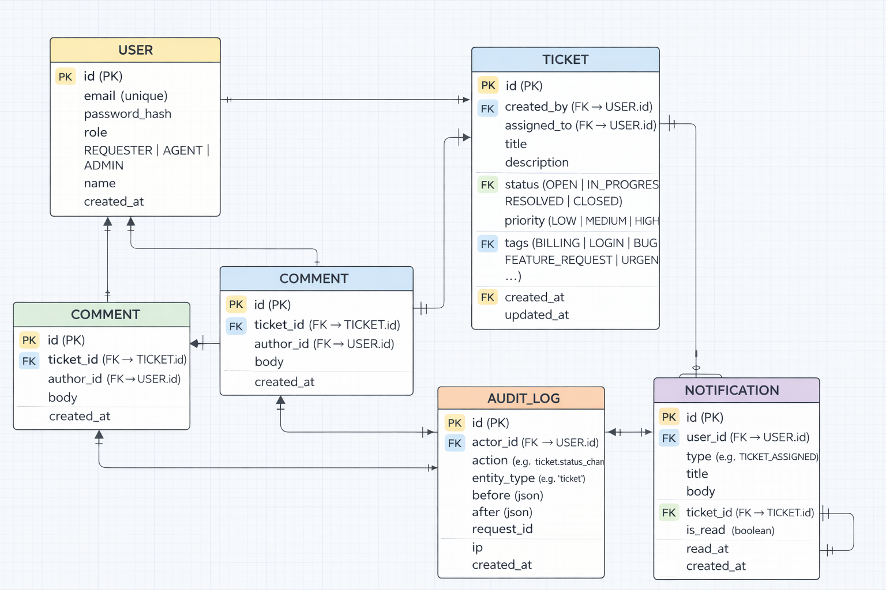

**Entities**
- USER
- TICKET *(includes tags as ENUM list)*
- COMMENT
- NOTIFICATION
- AUDIT_LOG

---

## UI mocks

Login
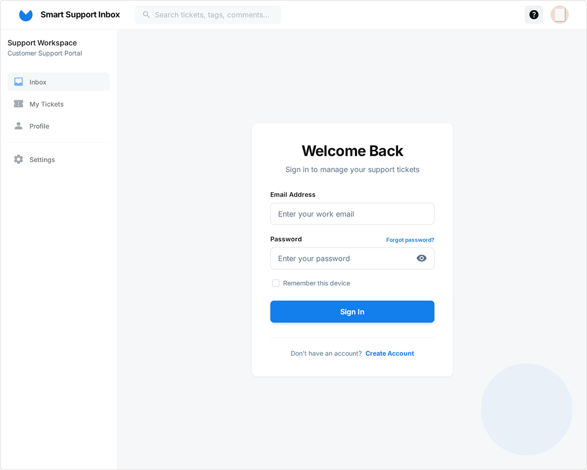

Dashboard
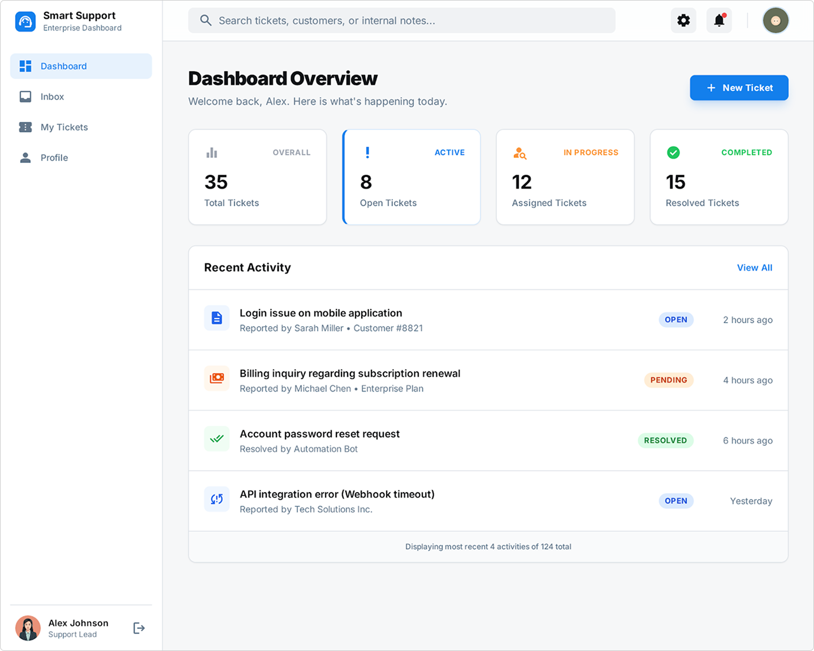

Ticket
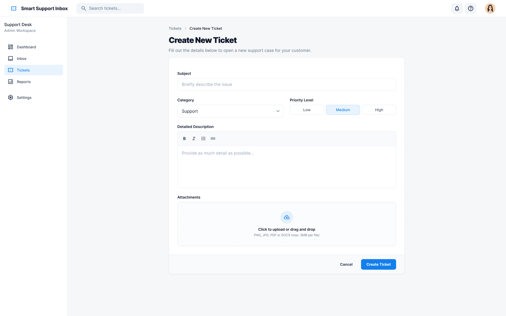
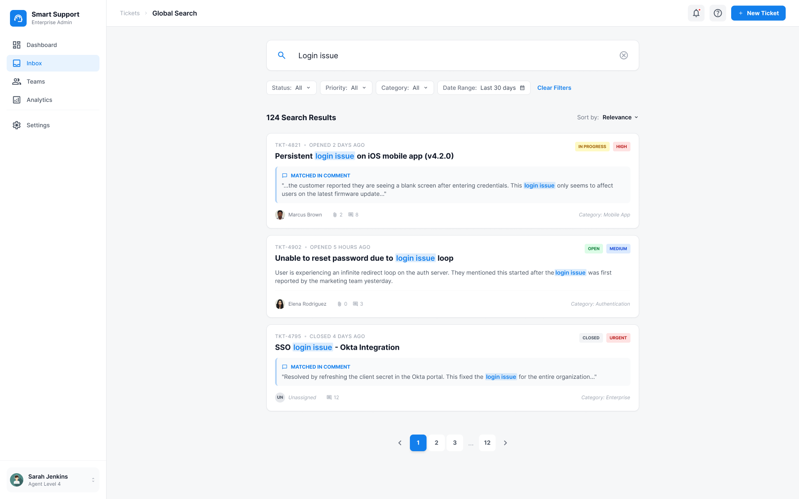
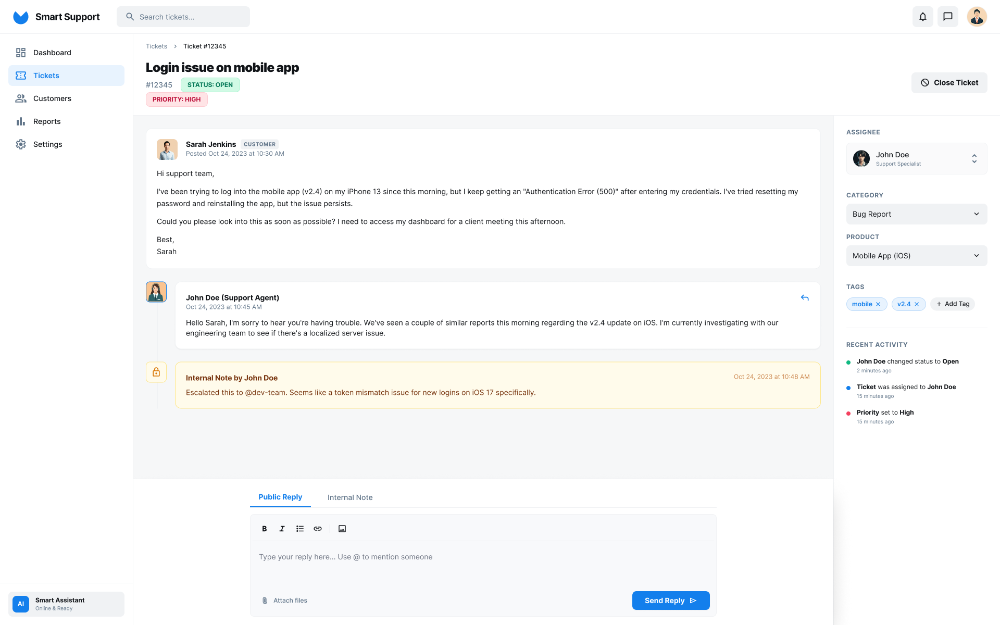
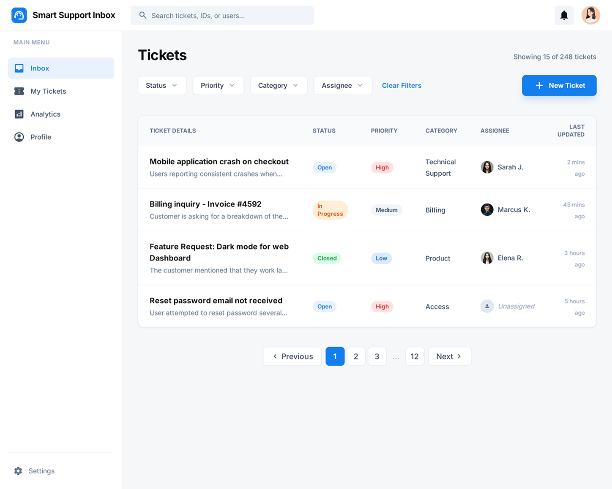

Knowledge Base
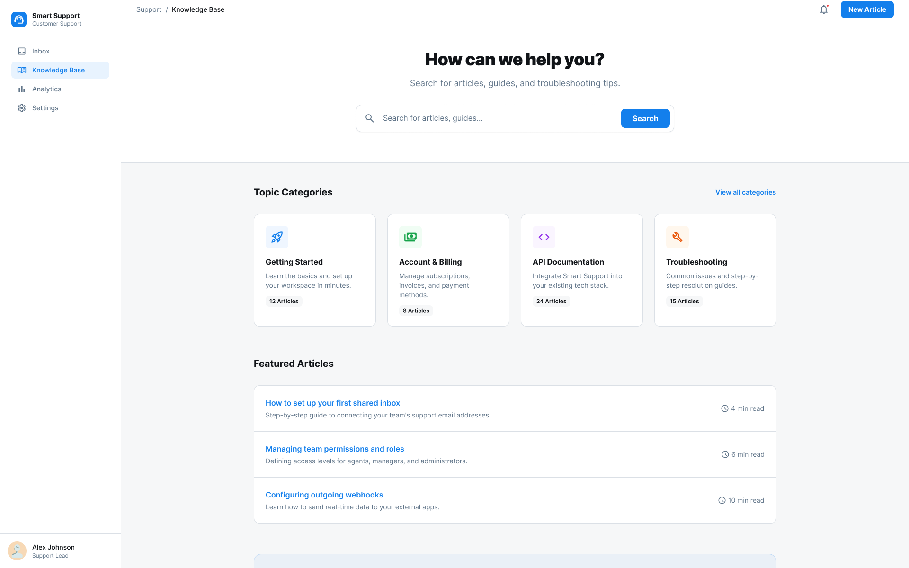
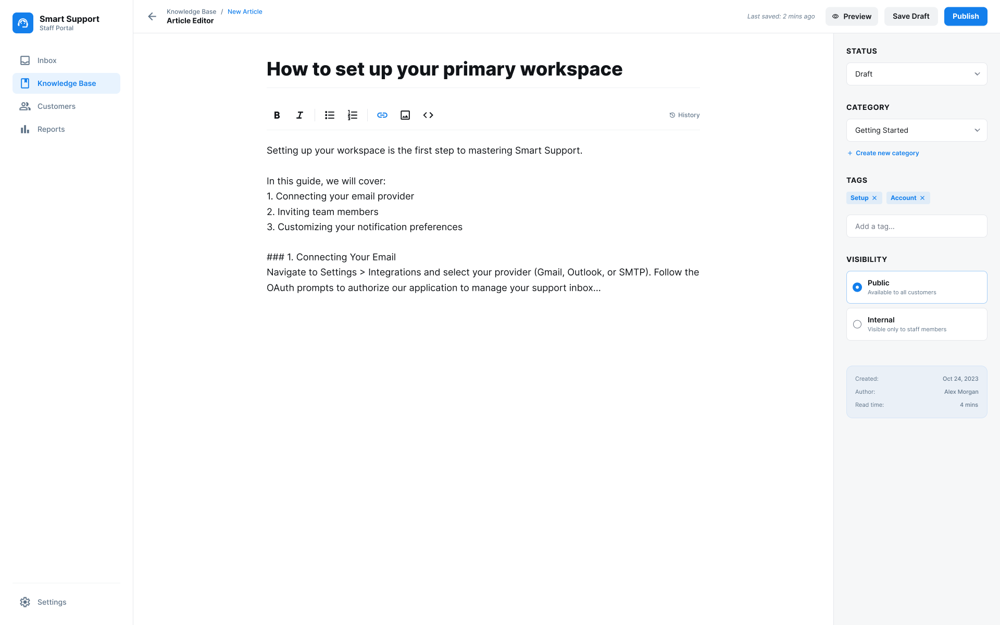

Notifications

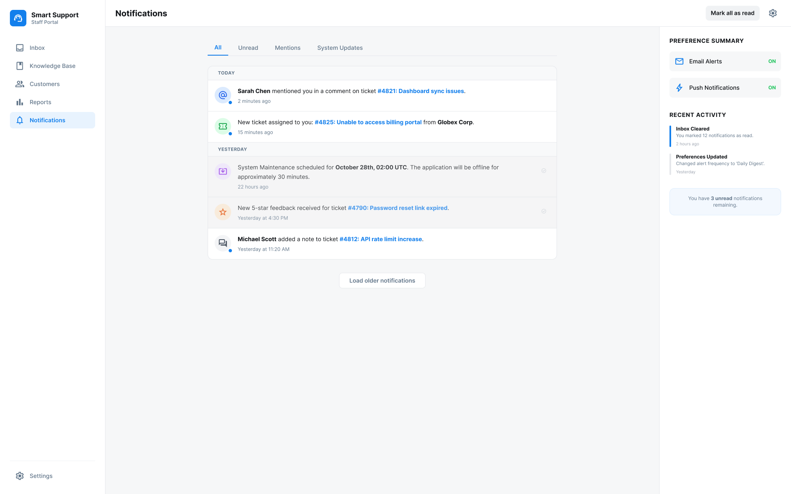
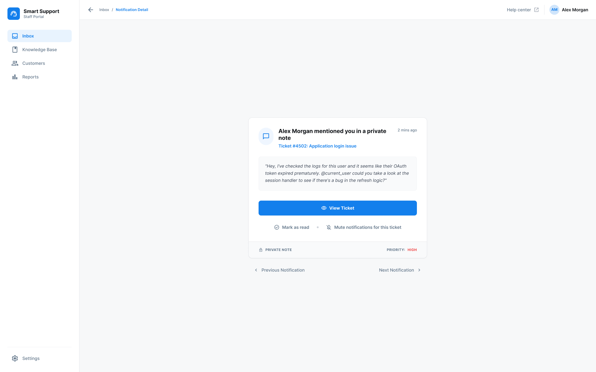

Profile
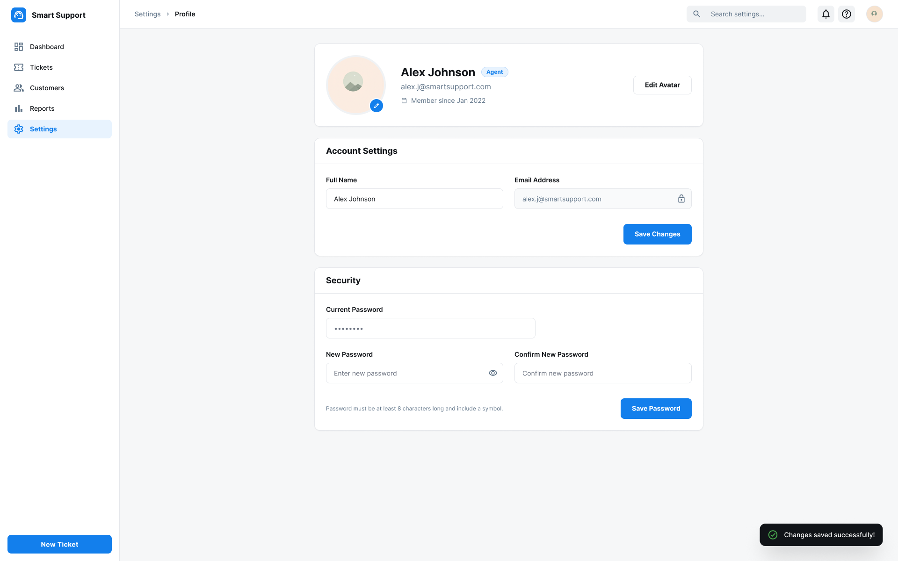

---

## API overview

### Auth
- `POST /auth/login`
- `POST /auth/logout`
- `GET /auth/me`

### Tickets
- `GET /tickets`
- `POST /tickets`
- `GET /tickets/{id}`
- `PATCH /tickets/{id}`

### Comments
- `GET /tickets/{id}/comments`
- `POST /tickets/{id}/comments`

### Search (Elasticsearch-backed)
- `GET /search?q=...`

### Notifications
- `GET /notifications`
- `GET /notifications/unread-count`
- `PATCH /notifications/{id}` *(mark read/unread)*
- `POST /notifications/mark-all-read`

### Audit
- `GET /tickets/{id}/activity`
- `GET /audit` *(admin only)*

---

## Local setup

This project runs locally using **Docker Compose**.

**Services**
- Backend: Django + DRF
- Frontend: React
- Postgres
- Kafka
- Elasticsearch

Run:
```bash
docker compose up --build

Open:

Frontend: http://localhost:3000
Backend API: http://localhost:8000

## Project structure
Example:

/backend        # Django API
/frontend       # React app
/infra          # docker-compose, env templates, scripts
/docs
  der.png
  /mocks

## DevSecOps goals

### CI pipeline
- Lint + tests
- Dependency scanning (Python + Node)

### Security basics
- CORS policy, auth hardening
- Secrets via environment variables (no secrets in git)

### Observability
- Structured logs
- Basic metrics *(optional)*

---

## Roadmap

- **Phase 1:** Auth + Tickets + Comments (Postgres)
- **Phase 2:** Search (Elasticsearch)
- **Phase 3:** Kafka events + indexing worker
- **Phase 4:** Notifications + audit timeline
- **Phase 5:** CI + security checks + monitoring
